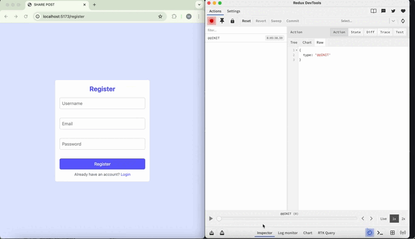

# 📍📍 A full-stack MERN application with basic authentication and CRUD actions

Here's what I implemented:
# 🔸 Frontend (React):

📌 React 19.1.0 with Vite for lightning-fast development

📌 Redux Toolkit for state management with multiple slices (Auth, Posts, Modal)

📌 React Router DOM v7 for client-side routing

📌 Tailwind CSS v4 for modern, responsive UI design

📌 React Icons for beautiful iconography

📌 React Toastify for user-friendly notifications

📌 Axios for HTTP requests with interceptors

📌 Custom hooks for token management

# 🔸 Backend (Node.js/Express):
📌 Express.js v5.1.0 with RESTful API architecture

📌 MongoDB with Mongoose ODM for data modeling

📌 JWT authentication with bcryptjs for password hashing

📌 Custom middleware for route protection

📌 CORS enabled for cross-origin requests

📌 Environment variables with dotenv

# 🔸 Authentication System:
✅ User registration & login with email validation

✅ JWT token-based authentication

✅ Password hashing with bcryptjs

✅ Protected routes with middleware

✅ Automatic token refresh handling

# 🔸 Post Management:
✅ CRUD operations (Create, Read, Update, Delete)

✅ Real-time state updates with Redux

✅ Modal-based post creation/editing

✅ Responsive grid layout for posts

# 🔸 User Experience:
✅ Responsive design with Tailwind CSS

✅ Toast notifications for user feedback

✅ Loading states and error handling

✅ Search functionality

✅ Hover effects and smooth transitions

# Preview of the Project

